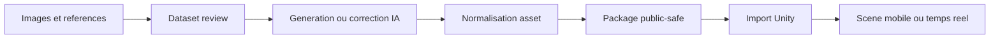
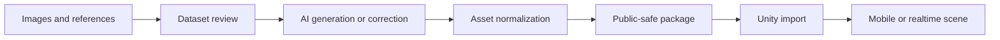

# 3D Unity Project Presentation / Presentation projet 3D Unity

> Public-safe presentation repository. This repository is a showcase and partnership brief, not a source-code release.

[FR](#francais) | [EN](#english)

## Francais

### Positionnement

Ce depot presente l'axe **3D / Unity / assets IA**: pipelines locaux pour generer, controler, preparer et importer des assets utilisables dans des environnements Unity.

Le fil directeur est simple: passer d'images, maps, rendus ou sorties IA a des assets propres, verifies, documentes et exploitables dans un projet mobile ou temps reel.

### Ce que ce depot contient

- Une presentation publique du projet 3D Unity.
- Une synthese des workflows: dataset, generation, controle, normalisation, import Unity.
- Une lecture partenariat: usages, besoins, risques, prochaines etapes.
- Des schemas non sensibles.
- Une cartographie des repos reels couverts, avec liens publics quand ils existent.

### Repos reels couverts

Ce depot est la vitrine publique de plusieurs repos reels:

- [`charli-dev420/splat-facade-baker`](https://github.com/charli-dev420/splat-facade-baker) - pipeline 2.5D / mobile Unity.
- [`charli-dev420/datasetvieweval`](https://github.com/charli-dev420/datasetvieweval) - preparation et evaluation de datasets Flux/Trellis2.
- [`charli-dev420/codextounity`](https://github.com/charli-dev420/codextounity) - prototype Codex / Unity / ComfyUI.
- `charli-dev420/unit2comf-frontend-backend-private` - suite Unity, mobile, web et backend ComfyUI, privee.
- pipeline local Unity / LocalAssetFactory - experimentation Unity et service local, non publie comme source.

Les details sont dans [`docs/repositories.md`](docs/repositories.md).

### Ce que ce depot ne contient pas

- Aucun code source critique.
- Aucun modele IA, poids, dataset, mesh prive ou sortie de generation.
- Aucun workflow ComfyUI prive, secret, endpoint local ou configuration GPU personnelle.
- Aucun contenu issu de `Library`, `Temp`, builds Unity, caches ou dossiers de sortie.

### Projet principal

Le projet vise un pipeline de production local:

- preparation de datasets image;
- scoring et revue qualite;
- generation ou correction via outils IA locaux;
- transformation vers assets 2.5D ou 3D utilisables;
- import Unity avec contraintes de pivot, echelle, bounds, orientation et validation;
- documentation de la provenance et de la qualite.

### Axes publics

- **DatasetViewEval / Flux3D**: preparation et evaluation d'images pour pipeline Flux/Trellis2.
- **Splat Facade Baker**: conversion de rendus, maps ou splats vers assets 2.5D legers.
- **Codex to Unity / ComfyUI**: orchestration locale prototype pour generation, controle et import d'assets Unity.
- **Unity mobile pipeline**: objectif de scene exploitable, pas seulement de generation visuelle.

### Recherche

Le projet recherche:

- partenaires Unity et mobile 3D;
- retours de production sur pipelines assets IA;
- financement pour stabilisation, tests Unity, packaging et documentation;
- collaboration autour d'outils editor, dataset review, ComfyUI, Trellis, Flux et assets temps reel.

### Contact

Contact public recommande: [GitHub charli-dev420](https://github.com/charli-dev420).

## English

### Positioning

This repository presents the **3D / Unity / AI assets** track: local pipelines for generating, reviewing, preparing, and importing assets that can be used in Unity environments.

The core direction is straightforward: move from images, maps, renders, or AI outputs to clean, reviewed, documented assets that are usable in a mobile or realtime project.

### What this repository contains

- A public presentation of the 3D Unity project.
- A workflow summary: dataset, generation, review, normalization, Unity import.
- A partnership view: use cases, needs, risks, next steps.
- Non-sensitive diagrams.
- A map of the real repositories covered, with public links when available.

### Real repositories covered

This repository is the public showcase for several real repositories:

- [`charli-dev420/splat-facade-baker`](https://github.com/charli-dev420/splat-facade-baker) - 2.5D / mobile Unity pipeline.
- [`charli-dev420/datasetvieweval`](https://github.com/charli-dev420/datasetvieweval) - Flux/Trellis2 dataset preparation and evaluation.
- [`charli-dev420/codextounity`](https://github.com/charli-dev420/codextounity) - Codex / Unity / ComfyUI prototype.
- `charli-dev420/unit2comf-frontend-backend-private` - Unity, mobile, web, and ComfyUI backend suite, private.
- local Unity / LocalAssetFactory pipeline - Unity and local-service experimentation, not published as source.

Details are in [`docs/repositories.md`](docs/repositories.md).

### What this repository does not contain

- No critical source code.
- No AI models, weights, datasets, private meshes, or generated outputs.
- No private ComfyUI workflows, secrets, local endpoints, or personal GPU configuration.
- No content from Unity `Library`, `Temp`, builds, caches, or output folders.

### Main project

The project targets a local production pipeline:

- image dataset preparation;
- quality scoring and review;
- generation or correction through local AI tools;
- transformation into usable 2.5D or 3D assets;
- Unity import with pivot, scale, bounds, orientation, and validation constraints;
- provenance and quality documentation.

### Public tracks

- **DatasetViewEval / Flux3D**: image preparation and evaluation for Flux/Trellis2 pipelines.
- **Splat Facade Baker**: conversion of renders, maps, or splats into lightweight 2.5D assets.
- **Codex to Unity / ComfyUI**: local prototype orchestration for Unity asset generation, review, and import.
- **Unity mobile pipeline**: focus on usable scenes, not only visual generation.

### Looking for

The project is open to:

- Unity and mobile 3D partners;
- production feedback on AI asset pipelines;
- funding for stabilization, Unity tests, packaging, and documentation;
- collaboration around editor tools, dataset review, ComfyUI, Trellis, Flux, and realtime assets.

### Contact

Recommended public contact: [GitHub charli-dev420](https://github.com/charli-dev420).
