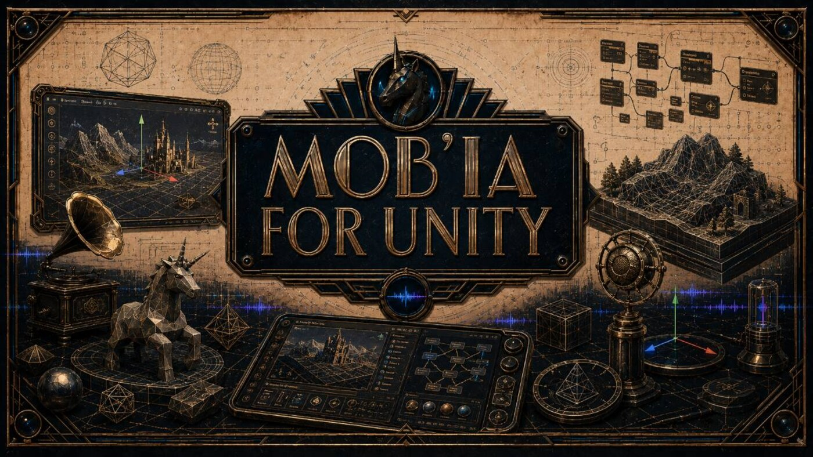
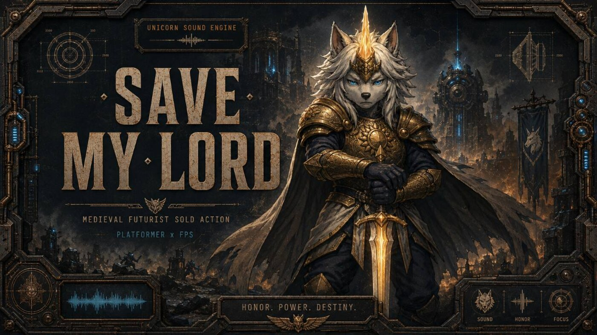

# Splat Face / Splat Facade Baker - 3D Unity Asset Pipeline

  

  
  
  
  

  <strong>From reviewed visual sources to lightweight Unity/mobile asset candidates with written quality criteria.</strong>

  <a href="#english">English</a> ·
  <a href="#francais">Francais</a> ·
  <a href="docs/overview.md">Overview</a> ·
  <a href="docs/projects/splat-face.md">Splat Face</a> ·
  <a href="docs/validation-scenarios.md">Validation Scenarios</a> ·
  <a href="docs/resources.md">Resources</a>

## English

### What This Repository Presents

This repository is the 3D / Unity presentation dossier for **Splat Face / Splat Facade Baker**, with the surrounding tools that make the pipeline understandable: source review, 2.5D asset preparation, Unity handoff, product job tracking, and local validation.

The main question is simple: can a visual source become a Unity/mobile asset candidate that another person can inspect, accept, revise, or reject with clear reasons?

**Splat Face / Splat Facade Baker** is the main project. It focuses on facade-oriented and lightweight 2.5D asset routes: framing, silhouette, depth-card thinking, texture readability, mobile constraints, and Unity import behavior.

The other surfaces support that path. **Dataset ReviewEval** keeps weak source material from entering the pipeline. **CodexUnity / CodexToUnity** frames the bridge between AI-assisted work, manifests, and Unity checks. **Mob'ia / ccomf-unity** gives jobs, profiles, artifacts, and clients a product surface. **LocalAssetFactory** keeps local asset preparation tied to manifests, normalization, import checks, and review notes.

### Start Here

Read [overview](docs/overview.md) for the product map. Read [Splat Face](docs/projects/splat-face.md) for the main project. Then read [Dataset ReviewEval](docs/projects/dataset-revieweval.md), [CodexUnity / CodexToUnity](docs/projects/codexunity-codextounity.md), [Mob'ia / ccomf-unity](docs/projects/mobia-ccomf-unity.md), and [LocalAssetFactory](docs/projects/local-asset-factory.md).

For practical reading, use [user flows](docs/user-flows.md), [tutorials](docs/tutorials.md), and [validation scenarios](docs/validation-scenarios.md). For proof and quality, use [evidence](docs/evidence.md), [proof pack](docs/proof-pack.md), [QA validation](docs/qa-validation.md), and [project evaluation](docs/project-evaluation.md).

### Project Lines

  
  <strong>Splat Face / Splat Facade Baker is the priority.</strong> 
  It explores how reviewed images, facade references, depth-card ideas, and lightweight asset rules can become Unity/mobile candidates with named criteria instead of loose visual output.

 

  
  <strong>Dataset ReviewEval starts the pipeline before generation.</strong> 
  The source choice is treated as a product decision: keep, fix, reject, export notes, and avoid wasting production time on weak references.

 

  
  <strong>CodexUnity, Mob'ia, and LocalAssetFactory make the handoff inspectable.</strong> 
  Jobs, manifests, artifact states, normalization, Unity import criteria, and written review notes make the asset route easier to explain to a collaborator, partner, funder, recruiter, or technical reviewer.

 

### What A Reader Can Find

- A clear main project: Splat Face / Splat Facade Baker.
- Separate pages for Dataset ReviewEval, CodexUnity / CodexToUnity, Mob'ia / ccomf-unity, and LocalAssetFactory.
- Practical flows for dataset triage, 2.5D candidate review, Unity handoff, and local asset preparation.
- Evidence and QA pages that describe how an asset candidate becomes credible enough to act on.
- Banners, diagrams, one-pager, proof dashboard, QA matrix, watermark, and iconography notes.

### Open Needs

Useful help includes Unity import review, mobile asset constraints, technical-art QA, dataset selection feedback, 2.5D/facade asset review, ComfyUI handoff feedback, documentation, funding, mission work, and roles around real-time production, local creative pipelines, and AI-assisted asset tooling.

Public contact route: [GitHub - Unicorn Who Dev](https://github.com/charli-dev420).

## Francais

### Ce Que Presente Ce Repo

Ce repo est le dossier de presentation 3D / Unity pour **Splat Face / Splat Facade Baker**, avec les outils qui rendent le pipeline comprehensible: revue source, preparation asset 2.5D, handoff Unity, suivi produit des jobs et validation locale.

La question principale est simple: une source visuelle peut-elle devenir un candidat asset Unity/mobile qu'une autre personne peut inspecter, accepter, reviser ou refuser avec des raisons claires ?

**Splat Face / Splat Facade Baker** est le projet principal. Il travaille les routes assets legeres et orientees facade: cadrage, silhouette, logique depth-card, lisibilite texture, contraintes mobile et comportement d'import Unity.

Les autres surfaces soutiennent ce chemin. **Dataset ReviewEval** evite que des sources faibles entrent dans le pipeline. **CodexUnity / CodexToUnity** cadre le pont entre travail assiste par IA, manifests et controles Unity. **Mob'ia / ccomf-unity** donne une surface produit aux jobs, profils, artefacts et clients. **LocalAssetFactory** relie preparation locale, manifests, normalisation, controles import et notes de revue.

### Commencer Ici

Lire [overview](docs/overview.md) pour la carte produit. Lire [Splat Face](docs/projects/splat-face.md) pour le projet principal. Lire ensuite [Dataset ReviewEval](docs/projects/dataset-revieweval.md), [CodexUnity / CodexToUnity](docs/projects/codexunity-codextounity.md), [Mob'ia / ccomf-unity](docs/projects/mobia-ccomf-unity.md) et [LocalAssetFactory](docs/projects/local-asset-factory.md).

Pour l'usage pratique, utiliser [user flows](docs/user-flows.md), [tutorials](docs/tutorials.md) et [validation scenarios](docs/validation-scenarios.md). Pour preuve et qualite, utiliser [evidence](docs/evidence.md), [proof pack](docs/proof-pack.md), [QA validation](docs/qa-validation.md) et [project evaluation](docs/project-evaluation.md).

### Lignes Projet

  
  <strong>Splat Face / Splat Facade Baker est la priorite.</strong> 
  Le projet explore comment des images revues, references facade, logiques depth-card et regles asset legeres deviennent des candidats Unity/mobile avec criteres nommes, pas seulement des sorties visuelles.

 

  
  <strong>Dataset ReviewEval commence le pipeline avant la generation.</strong> 
  Le choix source est traite comme une decision produit: garder, corriger, refuser, exporter des notes et eviter de perdre du temps sur des references faibles.

 

  
  <strong>CodexUnity, Mob'ia et LocalAssetFactory rendent le handoff inspectable.</strong> 
  Jobs, manifests, etats artefact, normalisation, criteres d'import Unity et notes de revue rendent la route asset plus claire pour collaborateur, partenaire, financeur, recruteur ou reviewer technique.

 

### Ce Qu'Un Lecteur Trouve

- Un projet principal clair: Splat Face / Splat Facade Baker.
- Des pages separees pour Dataset ReviewEval, CodexUnity / CodexToUnity, Mob'ia / ccomf-unity et LocalAssetFactory.
- Des flux pratiques pour tri dataset, revue candidat 2.5D, handoff Unity et preparation asset locale.
- Des pages evidence et QA qui expliquent comment un candidat asset devient assez credible pour agir.
- Bannieres, diagrammes, one-pager, dashboard preuve, matrice QA, watermark et notes iconographie.

### Besoins Ouverts

L'aide utile porte sur revue import Unity, contraintes asset mobile, QA technical-art, feedback selection dataset, revue asset 2.5D/facade, feedback handoff ComfyUI, documentation, financement, missions et postes autour de la production temps reel, des pipelines creatifs locaux et de l'outillage asset assiste par IA.

Contact public: [GitHub - Unicorn Who Dev](https://github.com/charli-dev420).
