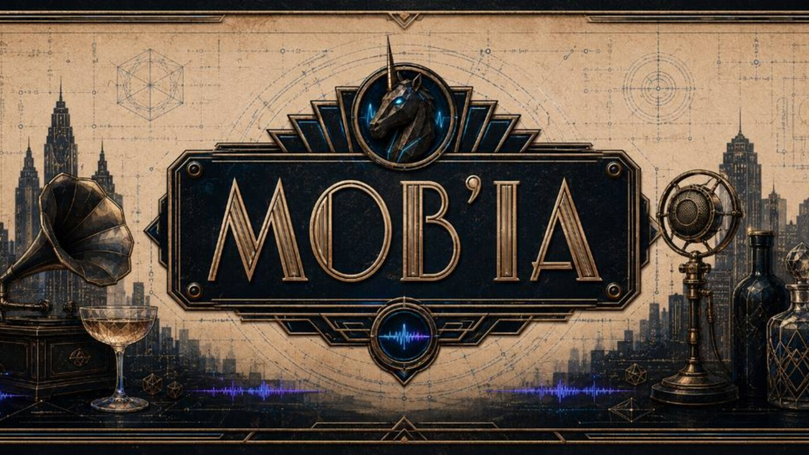

# Mob'ia / ccomf-unity - 3D Unity Project Presentation

  

  <strong>3D, Unity, dataset review, AI asset preparation, and local production tools by Unicorn Who Dev.</strong>

  <a href="#english">English</a> ·
  <a href="#francais">Francais</a> ·
  <a href="docs/one-pager.md">One-pager</a> ·
  <a href="docs/project-map.md">Project map</a> ·
  <a href="docs/source-facts.md">Source facts</a> ·
  <a href="docs/resources.md">Resources</a>

## English

### Project Overview

This repository presents the 3D / Unity part of my work through a readable project dossier. The covered tools all deal with the same problem: turning generated or collected visual material into something that can be reviewed, prepared, and used in a Unity-oriented workflow.

The main public product name is **Mob'ia / ccomf-unity**. Around it, the presentation also covers **Dataset ReviewEval**, **Splat Face / Splat Facade Baker**, **CodexUnity / CodexToUnity**, and **LocalAssetFactory**.

### Mob'ia / ccomf-unity

Mob'ia / ccomf-unity is the product layer around generation jobs. It is where profiles, pipelines, artifacts, review states, and client surfaces are meant to become readable instead of staying hidden inside a technical folder.

The project exists because AI generation is not useful by itself when the result cannot be tracked. A useful product needs to know which profile was used, which job ran, where the artifact is, whether the output was accepted or rejected, and what a Unity, web, or mobile client should show next.

Read more:
[project map](docs/project-map.md), [user flows](docs/user-flows.md), [source facts](docs/source-facts.md).

### Dataset ReviewEval

Dataset ReviewEval is the review side of the pipeline. Its role is to help inspect visual sources before they become training material, generation references, or asset candidates.

The project is about decisions that happen before generation: keeping strong images, rejecting weak or duplicated material, noting why a source is not usable, and preparing cleaner exports. This matters because bad source material usually becomes bad generated output later.

Read more:
[source facts](docs/source-facts.md), [tutorials](docs/tutorials.md), [QA validation](docs/qa-validation.md).

### Splat Face / Splat Facade Baker

Splat Face / Splat Facade Baker explores lighter 2.5D and facade-oriented asset routes. The target is not a heavy cinematic asset first. The target is a candidate that can be reasoned about: framing, silhouette, depth, texture readability, mobile constraints, and Unity import behavior.

This project is useful for facade tests, lightweight scene dressing, visual prototypes, and early mobile-friendly asset experiments.

Read more:
[proof pack](docs/proof-pack.md), [source facts](docs/source-facts.md), [visual index](docs/visual-index.md).

### CodexUnity / CodexToUnity

CodexUnity / CodexToUnity is the bridge between AI-assisted work and Unity review. It focuses on manifests, dry-runs, asset handoff, import checks, and the language needed to make a generated asset understandable inside an engine workflow.

The important part is the handoff: a file alone is not enough. Unity needs names, paths, scale expectations, material notes, import criteria, and a way for a human to decide what happens next.

Read more:
[repositories](docs/repositories.md), [user flows](docs/user-flows.md), [resources](docs/resources.md).

### LocalAssetFactory

LocalAssetFactory is the local production side: preflight, normalization, validation, and Unity-oriented preparation before an asset is treated as ready for review.

It sits close to the practical work: files on disk, generated artifacts, image or mesh variants, import readiness, and repeatable checks.

### What This Repository Contains

This repo contains public presentation material for the project family:

- project overview and one-page summary;
- project map across the related tools;
- source facts and public proof notes;
- user flows and tutorials;
- QA and blocker summaries;
- visual assets, banners, iconography, and brand notes;
- resources for users, collaborators, buyers, recruiters, and technical reviewers.

### Current Focus

The current focus is to make the project easier to understand and evaluate:

- clarify the role of Mob'ia / ccomf-unity as the product layer;
- document how dataset review feeds asset preparation;
- keep Splat Face / Splat Facade Baker readable as a lightweight Unity route;
- show where CodexUnity / CodexToUnity fits in the handoff;
- make the public docs useful without requiring access to every internal repo.

### Open Needs

The useful help right now is concrete:

- Unity or technical-art review on import criteria, scale, naming, materials, and mobile constraints;
- dataset review feedback on source selection and rejection reasons;
- product feedback on Mob'ia / ccomf-unity flows, profiles, jobs, and review states;
- funding, mission, or job discussions around Unity tooling, AI asset preparation, local pipelines, and creative production tools;
- people willing to read the docs like a real user and point out what is still unclear.

Public contact route: [GitHub - Unicorn Who Dev](https://github.com/charli-dev420).

## Francais

### Vue D'Ensemble

Ce repo presente la partie 3D / Unity de mon travail. Ce n'est pas un depot de code et ce n'est pas une page de pitch. C'est un dossier projet lisible pour plusieurs outils relies par le meme sujet: transformer du materiel visuel genere ou collecte en quelque chose que l'on peut revoir, preparer et utiliser dans un workflow oriente Unity.

Le nom produit public principal est **Mob'ia / ccomf-unity**. Autour, la presentation couvre aussi **Dataset ReviewEval**, **Splat Face / Splat Facade Baker**, **CodexUnity / CodexToUnity** et **LocalAssetFactory**.

### Mob'ia / ccomf-unity

Mob'ia / ccomf-unity est la couche produit autour des jobs de generation. C'est l'endroit ou profils, pipelines, artefacts, etats de revue et surfaces clientes doivent devenir lisibles au lieu de rester caches dans un dossier technique.

Le projet existe parce qu'une generation IA ne suffit pas si le resultat ne peut pas etre suivi. Un produit utile doit savoir quel profil a ete utilise, quel job a tourne, ou se trouve l'artefact, si la sortie est acceptee ou rejetee, et ce qu'un client Unity, web ou mobile doit montrer ensuite.

Lire aussi:
[carte projet](docs/project-map.md), [flux utilisateur](docs/user-flows.md), [faits sources](docs/source-facts.md).

### Dataset ReviewEval

Dataset ReviewEval est la partie revue de la chaine. Son role est d'aider a inspecter les sources visuelles avant qu'elles deviennent materiel d'entrainement, references de generation ou candidats assets.

Le projet concerne les decisions prises avant la generation: garder les bonnes images, rejeter les sources faibles ou dupliquees, noter pourquoi une source n'est pas exploitable et preparer des exports plus propres. C'est important parce qu'une mauvaise source devient souvent une mauvaise sortie generee.

Lire aussi:
[faits sources](docs/source-facts.md), [tutoriels](docs/tutorials.md), [QA validation](docs/qa-validation.md).

### Splat Face / Splat Facade Baker

Splat Face / Splat Facade Baker explore des routes asset plus legeres en 2.5D et facade. La cible n'est pas d'abord un asset cinematographique lourd. La cible est un candidat que l'on peut juger: cadrage, silhouette, profondeur, lisibilite texture, contraintes mobile et comportement d'import Unity.

Ce projet sert aux tests de facades, au decor de scene leger, aux prototypes visuels et aux premieres experimentations assets compatibles mobile.

Lire aussi:
[proof pack](docs/proof-pack.md), [faits sources](docs/source-facts.md), [index visuel](docs/visual-index.md).

### CodexUnity / CodexToUnity

CodexUnity / CodexToUnity est le pont entre le travail assiste par IA et la revue Unity. Il couvre manifests, dry-runs, handoff asset, controles d'import et le langage necessaire pour rendre un asset genere comprehensible dans un workflow moteur.

Le point important est le passage de relais: un fichier seul ne suffit pas. Unity a besoin de noms, chemins, attentes d'echelle, notes materiaux, criteres d'import et d'un moyen pour qu'une personne decide la suite.

Lire aussi:
[repositories](docs/repositories.md), [flux utilisateur](docs/user-flows.md), [ressources](docs/resources.md).

### LocalAssetFactory

LocalAssetFactory est la partie production locale: preflight, normalisation, validation et preparation orientee Unity avant qu'un asset soit considere pret a revoir.

Il reste proche du travail pratique: fichiers sur disque, artefacts generes, variantes image ou mesh, readiness import et controles repetables.

### Ce Que Contient Ce Repo

Ce repo contient le materiel public de presentation de cette famille de projets:

- vue d'ensemble et one-pager;
- carte des projets et outils relies;
- faits sources et notes de preuve publiques;
- flux utilisateur et tutoriels;
- syntheses QA et blockers;
- visuels, bannieres, iconographie et notes de marque;
- ressources pour utilisateurs, collaborateurs, acheteurs, recruteurs et reviewers techniques.

### Focus Actuel

Le focus actuel est de rendre le projet plus facile a comprendre et a evaluer:

- clarifier le role de Mob'ia / ccomf-unity comme couche produit;
- documenter comment la revue dataset alimente la preparation asset;
- garder Splat Face / Splat Facade Baker lisible comme route Unity legere;
- montrer ou CodexUnity / CodexToUnity intervient dans le handoff;
- rendre les docs publiques utiles sans exiger l'acces a tous les repos internes.

### Besoins Ouverts

L'aide utile maintenant est concrete:

- revue Unity ou technical-art sur criteres d'import, echelle, nommage, materiaux et contraintes mobile;
- feedback dataset sur selection des sources et raisons de rejet;
- feedback produit sur les flows Mob'ia / ccomf-unity, profils, jobs et etats de revue;
- financement, mission ou poste autour de l'outillage Unity, preparation d'assets IA, pipelines locaux et outils de production creative;
- personnes capables de lire les docs comme un vrai utilisateur et de signaler ce qui reste flou.

Contact public recommande: [GitHub - Unicorn Who Dev](https://github.com/charli-dev420).
