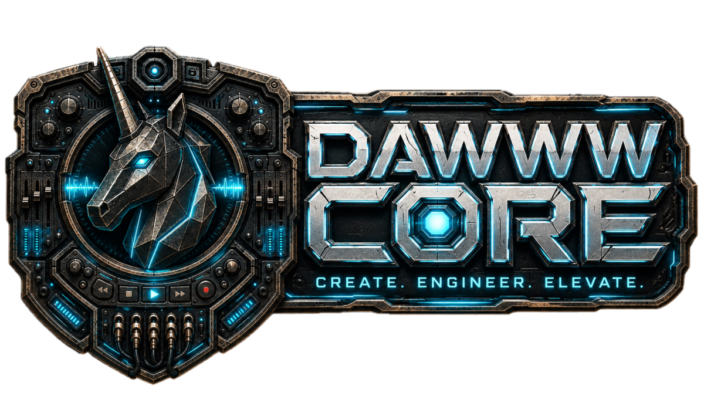

# 3D Unity Project Presentation / Presentation projet 3D Unity

  

> Public-safe showcase for the 3D, Unity, dataset, and AI-asset pipeline. This repository is a product and partnership surface, not a source-code release.

[FR](#francais) | [EN](#english) | [One-pager](docs/one-pager.md) | [Public scope](docs/public-scope.md)

## Francais

### Positionnement

Cette vitrine presente l'axe **3D / Unity / assets IA**: preparer des donnees visuelles, evaluer leur qualite, produire ou corriger des assets, puis les importer dans Unity avec des criteres exploitables.

Elle regroupe plusieurs repos reels. Le but n'est pas de publier leurs implementations, mais de donner a un utilisateur, acheteur ou collaborateur la documentation necessaire pour comprendre la chaine complete.

### Lire dans le bon ordre

| Besoin | Document |
| --- | --- |
| Comprendre la chaine complete | [One-pager](docs/one-pager.md), [carte projet](docs/project-map.md) |
| Voir l'etat actuel | [Statut courant](docs/current-status.md), [notes de diligence](docs/blockers.md) |
| Voir les repos reels | [Repos couverts](docs/repositories.md), [index des preuves](docs/public-proof-index.md) |
| Lire les preuves et la QA | [Proof pack](docs/proof-pack.md), [QA validation](docs/qa-validation.md), [visuels](docs/visual-index.md) |
| Suivre un parcours utilisateur | [Flux utilisateur](docs/user-flows.md), [tutoriels](docs/tutorials.md) |
| Evaluer la maturite | [Preuves](docs/evidence.md), [faits sources](docs/source-facts.md), [roadmap](docs/roadmap.md) |
| Decider comme acheteur ou collaborateur | [Buyer brief](docs/buyer-brief.md), [partenariats](docs/partnership.md) |
| Preparer une demo ciblee | [Decision pack](docs/decision-pack.md) |
| Identifier la marque | [Charte](docs/brand-charter.md), [iconographie](docs/iconography.md), [assets](assets/README.md) |

### Repos reels couverts

- [`charli-dev420/datasetvieweval`](https://github.com/charli-dev420/datasetvieweval) - evaluation et preparation de datasets Flux/Trellis2.
- [`charli-dev420/splat-facade-baker`](https://github.com/charli-dev420/splat-facade-baker) - pipeline 2.5D pour assets legers.
- [`charli-dev420/codextounity`](https://github.com/charli-dev420/codextounity) - pont public Codex / Unity / ComfyUI.
- **Mob'ia / ccomf-unity** - suite produit Unity, web, mobile et backend ComfyUI, privee.
- pipeline local **LocalAssetFactory / Asset Factory** - orchestration locale, non publiee comme source.

### Faits publics verifies

Verification du 2026-06-29:

| Surface | Signal public |
| --- | --- |
| DatasetViewEval | Repo public verifie a `2c9f37e`, licence MIT, app desktop locale, exports JSON/CSV/Markdown, baseline de tests documentee. |
| Splat Facade Baker | Repo public verifie a `b250387`, licence MIT, pipeline 2.5D pre-MVP avec cartes de profondeur et import Unity decrit. |
| CodexToUnity | Repo public verifie a `db72a01`, prototype experimental pour pont Codex / Unity / ComfyUI. |
| Mob'ia / ccomf-unity | Produit prive presente sous forme de carte publique: profils, jobs, artefacts, clients Unity/web/mobile. |

### Ce qui est public ici

Documentation produit, carte multi-repos, flux utilisateurs, tutoriels sans code sensible, preuves synthetisees, limites, roadmap, charte visuelle DAWWW Core et brief de collaboration.

### Ce qui reste exclu

Aucun code critique, modele, poids IA, dataset, mesh prive, workflow ComfyUI prive, endpoint local, configuration GPU, build Unity, cache, fichier `Library`, fichier `Temp`, log brut ou sortie de generation n'est publie ici.

### Recherche

Le projet recherche des partenaires Unity/mobile 3D, des retours de production sur assets IA, du financement pour stabilisation/QA/packaging, et des collaborations autour de dataset review, ComfyUI, Trellis, Flux et import temps reel.

Contact public recommande: [GitHub charli-dev420](https://github.com/charli-dev420).

## English

### Positioning

This showcase presents the **3D / Unity / AI asset** track: preparing visual data, evaluating quality, producing or correcting assets, and importing them into Unity with usable constraints.

It groups several real repositories. The goal is not to publish their implementation, but to provide the documentation a user, buyer, or collaborator needs to understand the full chain.

### Start here

| Need | Document |
| --- | --- |
| Understand the pipeline | [One-pager](docs/one-pager.md), [project map](docs/project-map.md) |
| Review current state | [Current status](docs/current-status.md), [readiness notes](docs/blockers.md) |
| Review real repositories | [Covered repositories](docs/repositories.md), [public proof index](docs/public-proof-index.md) |
| Read proof and QA | [Proof pack](docs/proof-pack.md), [QA validation](docs/qa-validation.md), [visuals](docs/visual-index.md) |
| Follow user workflows | [User flows](docs/user-flows.md), [tutorials](docs/tutorials.md) |
| Evaluate maturity | [Evidence](docs/evidence.md), [source facts](docs/source-facts.md), [roadmap](docs/roadmap.md) |
| Decide as buyer or collaborator | [Buyer brief](docs/buyer-brief.md), [partnership](docs/partnership.md) |
| Prepare a scoped demo | [Decision pack](docs/decision-pack.md) |
| Identify the brand | [Brand charter](docs/brand-charter.md), [iconography](docs/iconography.md), [assets](assets/README.md) |

### Covered real repositories

- [`charli-dev420/datasetvieweval`](https://github.com/charli-dev420/datasetvieweval) - Flux/Trellis2 dataset evaluation and preparation.
- [`charli-dev420/splat-facade-baker`](https://github.com/charli-dev420/splat-facade-baker) - lightweight 2.5D asset pipeline.
- [`charli-dev420/codextounity`](https://github.com/charli-dev420/codextounity) - public Codex / Unity / ComfyUI bridge.
- **Mob'ia / ccomf-unity** - private Unity, web, mobile, and ComfyUI backend product suite.
- local **LocalAssetFactory / Asset Factory** - local orchestration, not published as source.

### Verified Public Facts

Checked on 2026-06-29:

| Surface | Public signal |
| --- | --- |
| DatasetViewEval | Public repo checked at `2c9f37e`, MIT license, local desktop app, JSON/CSV/Markdown exports, documented test baseline. |
| Splat Facade Baker | Public repo checked at `b250387`, MIT license, pre-MVP 2.5D pipeline with depth-card flow and Unity import described. |
| CodexToUnity | Public repo checked at `db72a01`, experimental bridge prototype for Codex / Unity / ComfyUI. |
| Mob'ia / ccomf-unity | Private product surfaced as public map: profiles, jobs, artifacts, Unity/web/mobile clients. |

This repository publishes product documentation, workflows, tutorials, summarized evidence, limits, roadmap, DAWWW Core visual identity, and collaboration material. It does not publish critical source code, models, private datasets, generated assets, workflows, endpoints, local configs, Unity builds, logs, or caches.
