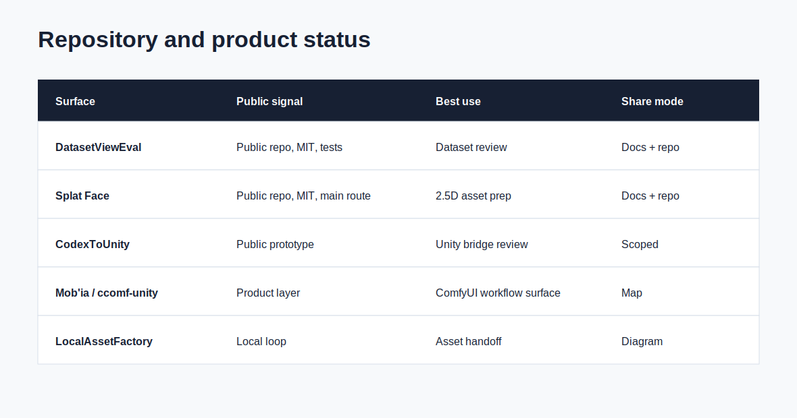

# Current Status / Statut courant

[EN](#english) | [FR](#francais)

## English

### Status Reading

Splat Face / Splat Facade Baker is the main project direction for this showcase. The strongest current value is the combination of public project structure, source-review discipline, 2.5D/mobile asset criteria, and Unity-facing QA language.

Dataset ReviewEval is the most concrete source-review surface. It gives the pipeline a way to explain image selection before asset work begins.

CodexUnity / CodexToUnity is the bridge surface for manifests and Unity handoff. It is useful for integration review and controlled workflow checks.

Mob'ia / ccomf-unity is the product layer around jobs and artifacts. It helps frame how a user or collaborator follows a generation or asset-preparation workflow.

LocalAssetFactory is the local validation loop. It keeps candidate files tied to normalization, manifest, import expectations, and written decisions.

### Positive Next Proof

The strongest next proof is a small reviewed source set, one Splat Face candidate route, one Unity import check, and one written accept/revise/reject decision.

## Francais

### Lecture Du Statut

Splat Face / Splat Facade Baker est la direction projet principale de cette vitrine. La valeur actuelle la plus forte vient de la combinaison structure projet publique, discipline de revue source, criteres asset 2.5D/mobile et langage QA oriente Unity.

Dataset ReviewEval est la surface de revue source la plus concrete. Elle donne au pipeline une maniere d'expliquer la selection image avant le travail asset.

CodexUnity / CodexToUnity est la surface de pont pour manifests et handoff Unity. Elle est utile pour revue integration et controles workflow cadres.

Mob'ia / ccomf-unity est la couche produit autour des jobs et artefacts. Elle aide a cadrer comment un utilisateur ou collaborateur suit un workflow de generation ou preparation asset.

LocalAssetFactory est la boucle de validation locale. Elle relie les fichiers candidats a normalisation, manifest, attentes import et decisions ecrites.

### Prochaine Preuve Positive

La prochaine preuve la plus forte est un petit lot source revu, une route candidat Splat Face, un controle import Unity et une decision ecrite accepter/reviser/refuser.
