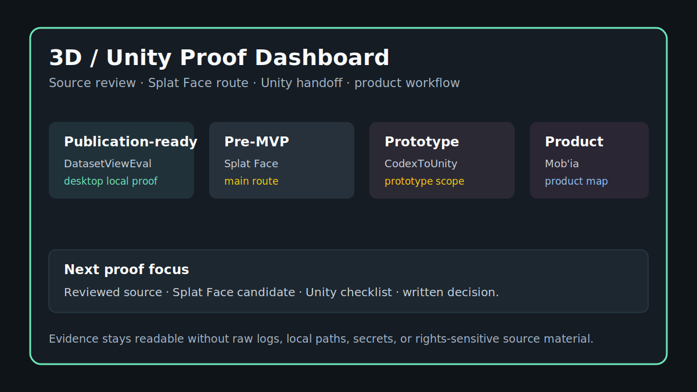

# Current Status / Statut courant

[EN](#english) | [FR](#francais)

## English

| Surface | Public status | Usable proof | Careful reading |
| --- | --- | --- | --- |
| Dataset ReviewEval / Flux3D Desktop | Public, publication-ready local app direction. | Publication audit, unit tests, `compileall`, backend API tests, secret scan. | Strong local desktop signal, not positioned as a public web app. |
| Splat Face / Splat Facade Baker | Public repository and pre-MVP pipeline direction. | Scaffolds, first executable paths, schemas, diagrams, product notes. | Strong architecture story; Unity/Blender/ComfyUI live proof should be scoped with cleared assets. |
| CodexUnity / CodexToUnity | Experimental public prototype. | Publication audit, experimental installer direction, dry-run/smoke paths. | Useful bridge surface; not positioned as a release candidate. |
| Mob'ia / ccomf-unity | Private product layer. | Public map of profiles, jobs, artifacts, Unity/web/mobile clients. | Product story is shareable; routes, storage, tokens, configs, and infra stay private. |
| LocalAssetFactory | Local/private validation concept. | Generation, normalization, manifest, preflight, and Unity handoff described. | Best reviewed through a controlled demo with public or cleared assets. |

### Public Position

The strongest current signal is the combination of documentation, publication hygiene, source review discipline, product mapping, and surface-by-surface QA evidence. The next step is not to publish private internals; it is to close one controlled validation proof at a time.

## Francais

| Surface | Statut public | Preuve exploitable | Lecture prudente |
| --- | --- | --- | --- |
| Dataset ReviewEval / Flux3D Desktop | App locale publique, direction publication-ready. | Audit publication, tests unitaires, `compileall`, tests API backend, scan secret. | Signal fort pour desktop local, pas positionne comme web app publique. |
| Splat Face / Splat Facade Baker | Repo public et direction pipeline pre-MVP. | Scaffolds, premiers chemins executables, schemas, diagrammes, notes produit. | Recit architecture fort; preuve live Unity/Blender/ComfyUI a cadrer avec assets autorises. |
| CodexUnity / CodexToUnity | Prototype public experimental. | Audit publication, direction installer experimental, chemins dry-run/smoke. | Surface pont utile; pas positionnee comme release candidate. |
| Mob'ia / ccomf-unity | Couche produit privee. | Carte publique des profils, jobs, artefacts, clients Unity/web/mobile. | Le recit produit est partageable; routes, stockage, tokens, configs et infra restent prives. |
| LocalAssetFactory | Concept de validation local/prive. | Generation, normalisation, manifest, preflight et handoff Unity decrits. | A revoir idealement via demo controlee avec assets publics ou autorises. |

### Positionnement public

Le signal actuel le plus fort combine documentation, hygiene de publication, discipline revue source, carte produit et preuves QA par surface. La prochaine etape n'est pas de publier les internes prives; c'est de fermer une preuve de validation controlee a la fois.
