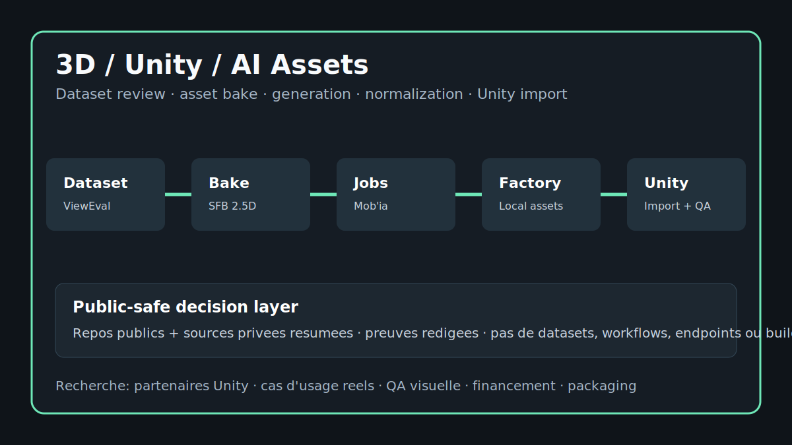

# Mob'ia / ccomf-unity One-Pager

[EN](#english) | [FR](#francais)

## English

### Product In One Sentence

**Mob'ia / ccomf-unity** is my product direction for turning AI visual material into reviewed, testable Unity/mobile asset candidates through source selection, preparation, handoff, and acceptance criteria.

### Why It Matters

AI output becomes useful only when the team can explain why a source image was chosen, what asset route was attempted, what Unity import check was run, and what should happen next. This project focuses on that control layer.

The public showcase connects the pieces I use to make that decision visible:

- **Dataset ReviewEval** helps score source images before they waste generation or bake time.
- **Splat Face / Splat Facade Baker** explores lightweight 2.5D and facade-oriented preparation for Unity/mobile scenes.
- **CodexUnity / CodexToUnity** frames the agent-to-Unity handoff: job shape, manifest, dry-run, sockets/import checks, and review trace.
- **LocalAssetFactory** describes the local preflight and normalization loop before an asset is handed to Unity.
- **Mob'ia / ccomf-unity** gives those pieces a product surface: profiles, jobs, artifacts, review states, and clients.

### What To Evaluate

A useful read should answer five concrete questions. Which source images would I keep or reject? What asset candidate would I prepare first? What Unity import criteria matter for scale, materials, naming, orientation, and mobile weight? What batch could be tested without opening the whole system? What short demo would produce a written accept/fix/reject decision?

The best reading path is [project map](project-map.md), [user flows](user-flows.md), [demo scenarios](demo-scenarios.md), [source facts](source-facts.md), [proof pack](proof-pack.md), and [buyer brief](buyer-brief.md).

### Good Next Conversations

Useful conversations include a cleared image batch, a mobile asset preparation pass, a Splat Face demo, a CodexUnity handoff review, a LocalAssetFactory preflight, an editor validation checklist, funding for a controlled proof, or a mission around creative tooling and real-time production.

## Francais

### Produit En Une Phrase

**Mob'ia / ccomf-unity** est ma direction produit pour transformer du materiel visuel IA en candidats assets Unity/mobile revus et testables, avec selection source, preparation, handoff et criteres d'acceptation.

### Pourquoi C'Est Important

Une sortie IA devient utile seulement si l'equipe peut expliquer pourquoi une image source a ete choisie, quelle route asset a ete tentee, quel controle d'import Unity a ete fait et quelle decision vient ensuite. Ce projet travaille cette couche de controle.

La vitrine publique relie les pieces que j'utilise pour rendre cette decision visible:

- **Dataset ReviewEval** aide a scorer les images sources avant de gaspiller du temps de generation ou de bake.
- **Splat Face / Splat Facade Baker** explore la preparation 2.5D legere et facade pour scenes Unity/mobile.
- **CodexUnity / CodexToUnity** cadre le handoff agent vers Unity: forme de job, manifest, dry-run, sockets/controles import et trace de revue.
- **LocalAssetFactory** decrit la boucle locale de preflight et normalisation avant transmission a Unity.
- **Mob'ia / ccomf-unity** donne a ces pieces une surface produit: profils, jobs, artefacts, etats de revue et clients.

### Ce Qu'Il Faut Evaluer

Une lecture utile doit repondre a cinq questions concretes. Quelles images sources garder ou rejeter ? Quel candidat asset preparer en premier ? Quels criteres d'import Unity comptent pour l'echelle, les materiaux, le nommage, l'orientation et le poids mobile ? Quel lot peut etre teste sans ouvrir tout le systeme ? Quelle demo courte produit une decision ecrite accepter/corriger/rejeter ?

Le meilleur chemin de lecture est [project map](project-map.md), [user flows](user-flows.md), [demo scenarios](demo-scenarios.md), [source facts](source-facts.md), [proof pack](proof-pack.md) et [buyer brief](buyer-brief.md).

### Bons Sujets De Discussion

Les discussions utiles portent sur un lot d'images autorisees, une passe de preparation asset mobile, une demo Splat Face, une revue de handoff CodexUnity, un preflight LocalAssetFactory, une checklist de validation editor, le financement d'une preuve controlee ou une mission autour du creative tooling et de la production temps reel.
