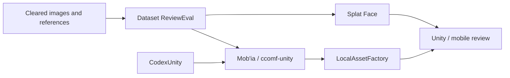

# Project Map / Carte projet

[EN](#english) | [FR](#francais)

## English

| Layer | Surface | Role | Published here | Good review question |
| --- | --- | --- | --- | --- |
| Dataset evaluation | Dataset ReviewEval / `datasetvieweval` | Review, score, and prepare visual datasets for Flux/Trellis-style work. | Operator path, quality criteria, export formats, public facts. | Can a reviewer explain why an image should be kept, fixed, or rejected? |
| 2.5D asset preparation | Splat Face / `splat-facade-baker` | Shape visual sources, maps, and depth-card ideas into lightweight Unity/mobile asset candidates. | Product status, expected outputs, asset criteria, demo framing. | What must be true before a 2.5D result is useful in Unity? |
| Agent bridge | CodexUnity / `codextounity` | Prototype bridge between agent-driven work, ComfyUI-style generation, asset manifests, and Unity import. | Architecture role, dry-run story, prototype boundaries. | Which part of the bridge should be validated in a controlled demo? |
| Product orchestration | Mob'ia / ccomf-unity | Product layer for profiles, async jobs, artifacts, and Unity/web/mobile clients around ComfyUI workflows. | Public product map, user journeys, partner needs. | Which client, workflow, or artifact review matters most for the buyer? |
| Local asset loop | LocalAssetFactory | Local service concept for preflight, normalization, manifest creation, and Unity handoff. | Validation concepts, QA checklist, handoff criteria. | Can an asset be accepted or rejected with clear, repeatable criteria? |

### Product Reading

The chain starts with source quality, not generation. It then moves through asset shaping, product orchestration, normalization, and Unity review. The final claim is not "the image looks good"; the final claim is "the asset has a known source, expected use, validation status, and Unity-facing acceptance criteria."

## Francais

| Couche | Surface | Role | Publie ici | Bonne question de revue |
| --- | --- | --- | --- | --- |
| Evaluation dataset | Dataset ReviewEval / `datasetvieweval` | Revoir, scorer et preparer des datasets visuels pour des travaux Flux/Trellis. | Parcours operateur, criteres qualite, formats d'export, faits publics. | Un reviewer peut-il expliquer pourquoi garder, corriger ou rejeter une image? |
| Preparation asset 2.5D | Splat Face / `splat-facade-baker` | Transformer sources visuelles, maps et logique depth-card en candidats legers Unity/mobile. | Statut produit, sorties attendues, criteres asset, cadrage demo. | Qu'est-ce qui doit etre vrai avant qu'un resultat 2.5D soit utile dans Unity? |
| Pont agent | CodexUnity / `codextounity` | Prototype entre travail pilote par agent, generation type ComfyUI, manifests asset et import Unity. | Role architecture, histoire dry-run, perimetre prototype. | Quelle partie du pont doit etre validee dans une demo controlee? |
| Orchestration produit | Mob'ia / ccomf-unity | Couche produit pour profils, jobs async, artefacts et clients Unity/web/mobile autour de ComfyUI. | Carte produit publique, parcours, besoins partenaire. | Quel client, workflow ou artefact compte le plus pour l'acheteur? |
| Boucle asset locale | LocalAssetFactory | Concept de service local pour preflight, normalisation, manifest et handoff Unity. | Concepts de validation, checklist QA, criteres handoff. | Peut-on accepter ou rejeter un asset avec des criteres clairs et repetables? |

### Lecture produit

La chaine commence par la qualite des sources, pas par la generation. Elle passe ensuite par la preparation asset, l'orchestration produit, la normalisation et la revue Unity. Le claim final n'est pas "l'image est jolie"; le claim final est "l'asset a une source, un usage attendu, un statut de validation et des criteres d'acceptation Unity".
