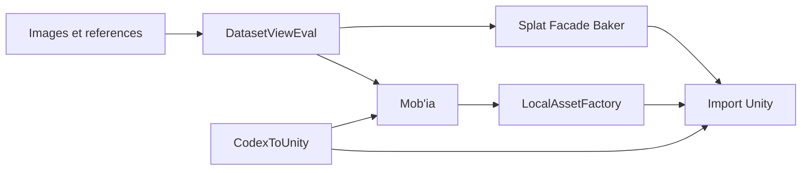

# Project Map / Carte projet

[FR](#francais) | [EN](#english)

## Francais

| Couche | Repo ou surface | Role | Publie ici | Non publie |
| --- | --- | --- | --- | --- |
| Evaluation dataset | `datasetvieweval` | Revue, scoring et preparation de datasets Flux/Trellis2. | Parcours operateur, criteres qualite, formats expliques. | Datasets, sorties privees, configs locales. |
| Asset 2.5D | `splat-facade-baker` | Conversion de rendus/maps/splats vers assets legers. | Statut produit, sorties attendues, limites. | Code, meshes, textures privees, datasets. |
| Pont Unity | `codextounity` | Prototype Codex / Unity / ComfyUI pour generation, controle et import. | Role architecture, flux public, limites. | Workflows prives, endpoints locaux, scripts sensibles. |
| Suite ComfyUI | Mob'ia / ccomf-unity | Backend et surfaces Unity/web/mobile pour jobs ComfyUI. | Carte produit et besoins. | Routes exactes, configs, tokens, details infra. |
| Factory locale | LocalAssetFactory | Service local pilote par Codex pour assets et validation Unity. | Concepts et criteres de validation. | Service, workflows, modeles, GLB, chemins locaux. |

### Lecture produit

La chaine cible commence par la qualite des donnees, puis passe par generation/correction, normalisation et import Unity. Le critere final n'est pas "une image jolie", mais un asset documente, controle et utilisable dans un environnement temps reel.

## English

The target chain starts with data quality, then moves through generation or correction, normalization, and Unity import. The final criterion is not a nice image; it is a documented, controlled, usable asset for realtime environments.
