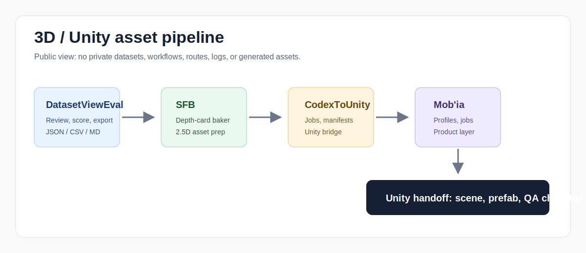

# Dataset ReviewEval

[EN](#english) | [FR](#francais)

## English

### Product Definition

Dataset ReviewEval is the source-review surface that comes before asset preparation. It helps inspect visual material, keep the strong references, reject weak or duplicated inputs, and export readable notes before Splat Face or another asset route spends time on them.

Good asset work starts with good source decisions. If a facade image is badly framed, too noisy, too duplicated, impossible to license, or visually unclear, the pipeline should say so early.

### Who It Helps

It helps dataset operators, visual reviewers, technical artists, AI pipeline builders, and teams that need a traceable way to decide which images should feed generation, bake, or asset preparation work.

### Workflow

1. Load a small source batch.
2. Review images for framing, readability, duplicates, rights status, subject clarity, and expected asset value.
3. Mark each source as keep, fix, reject, or revisit.
4. Export notes in a readable format.
5. Feed only the useful sources into Splat Face, CodexUnity, or another preparation route.

### What This Repository Shows

This repo shows the role of Dataset ReviewEval in the 3D pipeline, the reading path, source facts, tutorials, and proof notes that make source review understandable to another person.

### Useful Support

Useful support includes dataset criteria, reviewer UX, export format review, visual quality rules, source licensing discussion, and practical source batches for Unity/mobile asset preparation.

## Francais

### Definition Produit

Dataset ReviewEval est la surface de revue source qui vient avant la preparation asset. Elle aide a inspecter le materiel visuel, garder les bonnes references, refuser les entrees faibles ou dupliquees et exporter des notes lisibles avant que Splat Face ou une autre route asset y consacre du temps.

Un bon travail asset commence par de bonnes decisions source. Si une image de facade est mal cadree, trop bruitee, trop dupliquee, impossible a licencier ou visuellement floue, le pipeline doit le dire tot.

### A Qui Ca Sert

Il sert aux operateurs dataset, reviewers visuels, technical artists, builders de pipeline IA et equipes qui veulent une maniere tracable de decider quelles images doivent alimenter generation, bake ou preparation asset.

### Workflow

1. Charger un petit lot source.
2. Revoir les images pour cadrage, lisibilite, doublons, droits, clarte du sujet et valeur asset attendue.
3. Marquer chaque source: garder, corriger, refuser ou revoir plus tard.
4. Exporter des notes dans un format lisible.
5. Envoyer seulement les sources utiles vers Splat Face, CodexUnity ou une autre route de preparation.

### Ce Que Montre Ce Repo

Ce repo montre le role de Dataset ReviewEval dans le pipeline 3D, le chemin de lecture, les faits sources, tutoriels et notes de preuve qui rendent la revue source comprehensible pour une autre personne.

### Support Utile

Le support utile inclut criteres dataset, UX reviewer, revue formats export, regles de qualite visuelle, discussion licences source et lots pratiques pour preparation asset Unity/mobile.
