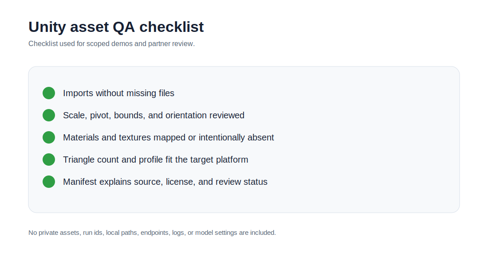

# LocalAssetFactory

[EN](#english) | [FR](#francais)

## English

### Product Definition

LocalAssetFactory is the local preparation and validation loop for assets before they are treated as ready for Unity review. It connects naming, manifests, normalization, format expectations, import checks, and written decisions.

It is useful because a generated or prepared file is not automatically an asset. It has to be identifiable, importable, reviewable, and useful for the target scene.

### Who It Helps

It helps technical artists, Unity users, local pipeline builders, reviewers, and teams that need practical checks before a candidate is accepted.

### Workflow

1. Receive an asset candidate and its expected role.
2. Check naming, source note, manifest, format, and expected output.
3. Review scale, orientation, pivot, bounds, materials, texture expectations, and platform weight.
4. Prepare a Unity-facing handoff note.
5. Record whether the candidate should move forward, be revised, be rejected, or stay in review.

### What This Repository Shows

This repo shows the LocalAssetFactory role as the practical validation loop beside Splat Face and CodexUnity: preflight, normalization, manifest, Unity check, and human decision.

### Useful Support

Useful support includes import QA, naming rules, manifest review, technical-art feedback, Blender/GLB inspection, mobile constraints, and local automation review.

## Francais

### Definition Produit

LocalAssetFactory est la boucle locale de preparation et validation avant de considerer un asset pret pour revue Unity. Elle relie nommage, manifests, normalisation, attentes format, controles import et decisions ecrites.

Elle est utile parce qu'un fichier genere ou prepare n'est pas automatiquement un asset. Il doit etre identifiable, importable, reviewable et utile pour la scene cible.

### A Qui Ca Sert

Elle sert aux technical artists, utilisateurs Unity, builders de pipeline local, reviewers et equipes qui veulent des controles pratiques avant d'accepter un candidat.

### Workflow

1. Recevoir un candidat asset et son role attendu.
2. Controler nommage, note source, manifest, format et sortie attendue.
3. Revoir echelle, orientation, pivot, bounds, materiaux, attentes texture et poids plateforme.
4. Preparer une note de handoff orientee Unity.
5. Noter si le candidat doit avancer, etre revise, etre refuse ou rester en revue.

### Ce Que Montre Ce Repo

Ce repo montre le role LocalAssetFactory comme boucle de validation pratique a cote de Splat Face et CodexUnity: preflight, normalisation, manifest, controle Unity et decision humaine.

### Support Utile

Le support utile inclut QA import, regles de nommage, revue manifest, feedback technical-art, inspection Blender/GLB, contraintes mobile et revue automatisation locale.
