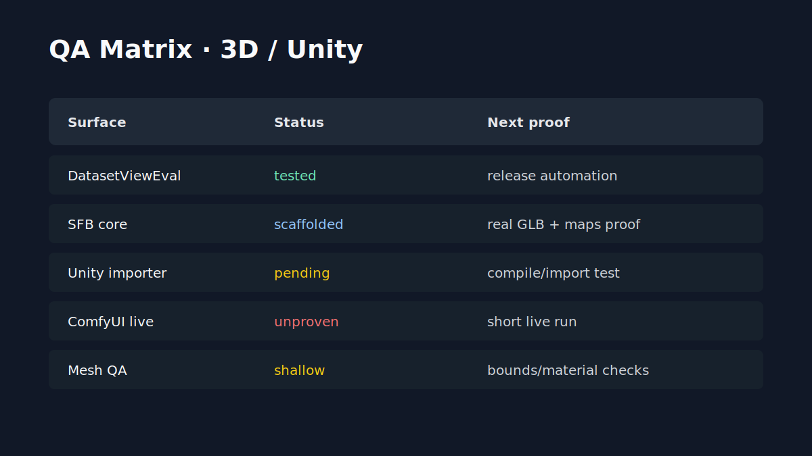

# QA Validation / Validation QA

[EN](#english) | [FR](#francais)

## English

### QA Matrix

| Surface | Known validation | Next proof to close | Decision value |
| --- | --- | --- | --- |
| Dataset ReviewEval | `unittest`, `compileall`, backend API tests, local model-role readiness, documented export formats. | Unified release automation and final packaging pass. | Strong signal for a local desktop review tool. |
| Splat Face core/dataset/orchestrator | Public scaffolds, smoke paths, and pipeline documentation. | Validation with cleared GLB/visual inputs, Blender review, Unity import, and ComfyUI route where applicable. | Shows whether the 2.5D route can produce reviewable Unity candidates. |
| Unity importer and handoff | Importer scaffold and Unity-facing criteria documented. | Compilation/test in a disposable Unity project with public-safe summary. | Converts pipeline claims into Unity acceptance evidence. |
| Mob'ia / ccomf-unity product flow | Product map, profile/job/artifact/client flow, and demo scenarios. | Scoped product walkthrough with one role, one job, one artifact, and one review decision. | Shows the product layer as a practical workflow, not only infrastructure. |
| CodexUnity bridge | Dry-run paths, plugin surface, manifest direction, and smoke documentation. | Short controlled live validation with redacted outputs and Unity handoff notes. | Establishes how much of the bridge is ready for deeper collaboration. |
| LocalAssetFactory | Public-safe loop and checklist. | Handoff with a public or cleared asset and explicit accept/reject criteria. | Makes the private/local loop discussable without exposing private runs. |

### Public QA Rule

A public QA note should include source category, scenario, abstract environment, expected result, observed result, acceptance decision, known constraint, and next action. It should not publish generated files, datasets, GLB files, outputs, logs, private workflows, endpoints, or local paths.

### Positive Framing

The QA posture is not "everything is blocked." The posture is: the public dossier already explains the chain, and each next validation step is narrow enough to be turned into a credible proof.

## Francais

### Matrice QA

| Surface | Validation connue | Prochaine preuve a fermer | Valeur de decision |
| --- | --- | --- | --- |
| Dataset ReviewEval | `unittest`, `compileall`, tests API backend, readiness locale role modele, formats export documentes. | Automation release unifiee et passe packaging finale. | Signal fort pour outil desktop local de revue. |
| Core/dataset/orchestrator Splat Face | Scaffolds publics, chemins smoke et documentation pipeline. | Validation avec entrees GLB/visuelles autorisees, revue Blender, import Unity et route ComfyUI si applicable. | Montre si la route 2.5D produit des candidats Unity revisables. |
| Importer et handoff Unity | Scaffold importer et criteres Unity documentes. | Compilation/test dans projet Unity jetable avec resume public-safe. | Transforme les claims pipeline en preuve d'acceptation Unity. |
| Flow produit Mob'ia / ccomf-unity | Carte produit, flow profil/job/artefact/client et scenarios demo. | Walkthrough produit cible avec un role, un job, un artefact et une decision de revue. | Montre la couche produit comme workflow pratique, pas seulement infra. |
| Pont CodexUnity | Chemins dry-run, surface plugin, direction manifest et documentation smoke. | Validation live courte et controlee avec sorties redigees et notes handoff Unity. | Etablit quelle partie du pont est prete pour collaboration plus profonde. |
| LocalAssetFactory | Boucle public-safe et checklist. | Handoff avec asset public ou autorise et criteres accept/reject explicites. | Rend la boucle privee/locale discutable sans exposer les runs. |

### Regle QA publique

Une note QA publique doit inclure categorie source, scenario, environnement abstrait, resultat attendu, resultat observe, decision d'acceptation, contrainte connue et prochaine action. Elle ne doit pas publier fichiers generes, datasets, GLB, outputs, logs, workflows prives, endpoints ou chemins locaux.

### Formulation positive

La posture QA n'est pas "tout est bloque". Elle est: le dossier public explique deja la chaine, et chaque validation suivante est assez etroite pour devenir une preuve credible.
